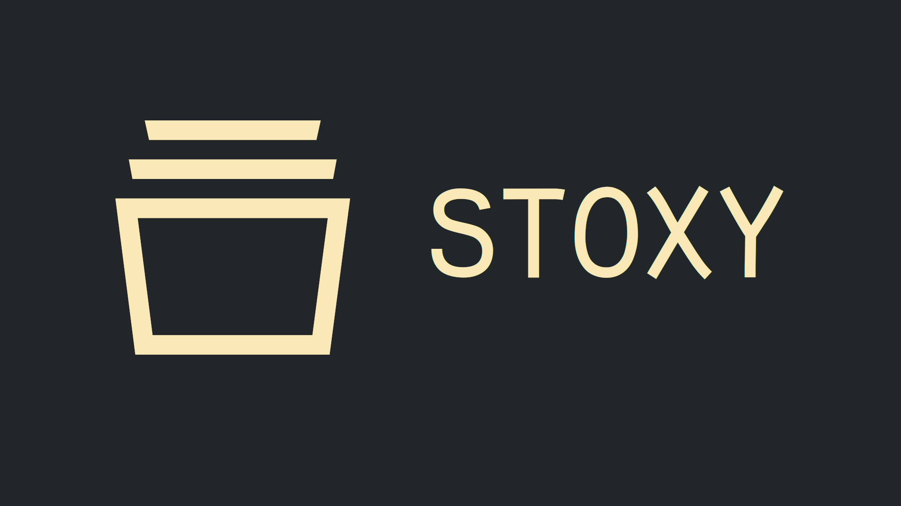

# 🗂️ Stoxy

Stoxy is a state management API equipped with Web Components.

Stoxy allows you to easily handle, persist and update data in your DOM without the weight of a framework.

# 📖 Official docs

Official docs can be found [here](https://stoxy.dev)

## ❓ How

Stoxy utilizes the browser's tooling with respect to your computer's memory.

Stoxy stores the data in a in-browser Database called [IndexedDB](https://developer.mozilla.org/en-US/docs/Web/API/IndexedDB_API),
only keeping the latest 5 accessed objects in-memory for faster access.

Stoxy utilizes a promise-based use flow making it really easy to asynchronously read and write from the storage.

If your browser doesn't support IndexedDB, there's no need to worry. Stoxy recognizes these cases automatically, and
opts out of using it and utilizes a in-memory system only.

## ❓ Why


### Motivation

The motivation behind Stoxy as to provide a simpler solution for cross-app state management.

With Stoxy you are up and running after writing just one line of code. After setting your first state object, 
you have a functional state system ready to be used.

```js copy
import { write } from "@stoxy/core";

write("users", userList);
```

### Simplicity

All of Stoxy's commands are 1-2 parameters long, and can be executed as "one-liners".

They are however extremely extendable due to the nature of the state management system of Stoxy. Some of the Stoxy core
functions like `update` and `remove`  even take delegates or predicates as a parameter to give the developer
more control over their state management.

### Ecosystem

Stoxy ships with a small set of Web Components, which are framework agnostic components ready for use in any project.

The components are built to as reactive pieces of an application, updating their contents according to state
change without the developer having to do any work.

When writing websites with dynamic content, the markdown can easily become a spaghetti of plain text and
Javascript escaped variables inside a template literal. like:

```javascript
<h1>Hello, ${user.name}</h1>
<p>Your profile has accumulated ${user.viewCount} views</p>
<p>Top 3 visitors on your page:</p>
<ul>
    ${
        user.topVisitors.map(vis => `<li>${vis}</li>`);
    }
</ul>
```

With Stoxy, the same markdown could be created without being in the same context as the data with:

```html
<stoxy-object key="user" prefix="u.">
    <h1>Hello, u.name</h1>
    <p>Your profile has accumulated u.viewCount views</p>
    <p>Top 3 visitors on your page:</p>
    <ul>
        <stoxy-repeat key="user.topVisitors" id="vis">
            <li>vis</li>
        </stoxy-repeat>
    </ul>
</stoxy-object>
```

⚠️ **Dynamic content inside Stoxy Elements updates when the data does. Update once, DOM updates everywhere.**


### Persistence

Stoxy comes shipped with persistence out of the box. There are many cases in which it is beneficial to persist the state
data through page reloads and navigation. Wether it be stale-while-revalidate patterns, or just static information fetched 
from the API.

The Persistence in Stoxy is opt-in, meaning that you control exactly what information gets persisted.


### Use them how you want to

The whole core set of Stoxy is built from smaller modules, which can be attached at will.

This means that you can use Stoxy only for managing state, and then handle all the events through subscribers,
or you can go all in on Stoxy and deploy a whole application built with stoxy elements using barely any Javascript


## 🔔 Reactivity

Stoxy is a reactive state management system, meaning that when you update the data in Stoxy with the `write` command,
all of the elements using that object will automatically update their content in the DOM.

No more need for flowing data around the whole system.

```javascript
write('user', newData);

// Triggers update in the element below

<stoxy-object key="user" prefix="u.">
    <p>Hello, u.name</p>
</stoxy-object>;
```

Stoxy will not update any element which's data didn't change, enhancing the performance greatly.

**_ Only the DOM elements which had their data changed will be updated _**

## 🧰 Installation

To install the full stoxy suite, run

```sh
npm install @stoxy/stoxy
```

You can also install packages from the stoxy suite as standalone modules.

```sh
npm install @stoxy/core @stoxy/string @stoxy/repeat @stoxy/form @stoxy/object
```

## Usage

Stoxy can be used currently in 3 ways, which interoperate between each other:

1. With just the @stoxy/core and the function below
2. With Stoxy Elements
3. With [Stoxy Element Mixin](https://github.com/stoxy-js/stoxy-element-mixin)

You can freely mix and match these implementations too! 

#### Write

```js
import { write } from '@stoxy/core';

write("counter", 0);

```

---

```js
import { write } from '@stoxy/core';


write("Shoppingcart", [{id: 123, name: "Free gift"}]);
```

#### Read

```js
import { read } from '@stoxy/core';

read('shoppingcart').then(shoppingCartItems => {
    shoppingCartItems.map(item => console.log(item));
});
```

---

```js
import { read } from '@stoxy/core';

async function getItems() {
    const items = await read('shoppingcart');
    return items;
}
```

#### Sub

```js
import { sub } from '@stoxy/core';

sub("shoppingcart", updateItemCount);

function updateItemCount(e) {
    write("itemcount", e.data.length);
}
```

#### Clear

```js
import { clear } from '@stoxy/core';

clear('shoppingcart');
```

#### Update

```js
import { write, update } from '@stoxy/core';

write("counter", 0);

// Update counter every second
setInterval(() => {
    update("counter", counter => counter += 1);
}, 1000);

```

#### Remove

```js
import { remove } from '@stoxy/core';

// Removes product with the id 1
remove("shoppingcart", product => product.id === 1);
```

---

```js
import { remove } from '@stoxy/core';

// Remove all products with a price over 5
remove("shoppingcart", product => product.price > 5);
```

---

```js
import { remove } from '@stoxy/core';

// Remove all meat
remove("shoppingcart", removeMeat);

function removeMeat(product) {
    if (product.type === "Meat" || product.type === "Chicken") {
        return true;
    }
    return false;
}
```

#### Persist key

```js
import { persistKey } from '@stoxy/core';

persistKey('shoppingcart');

// with multiple keys
persistKey('shoppingcart', 'history', 'address');
```
